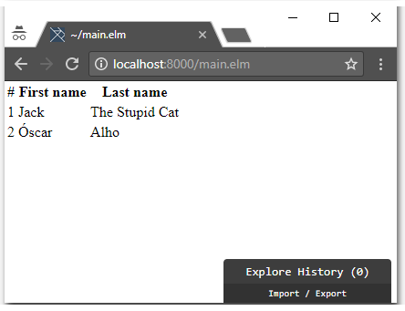
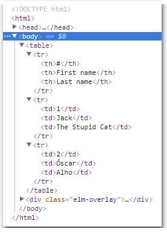
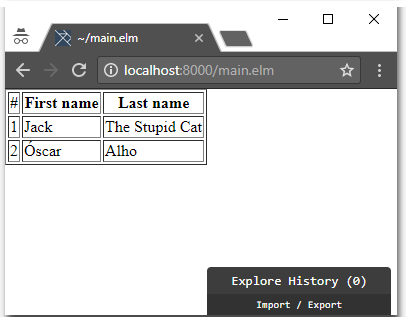

# Lunch and Learn - ELM (Day 2)

Today we want something a little more elaborate from our ELM application.

We wish to construct an application which enables a user to edit some contents in a `table`, as well as add more rows to it.

For the MVP (minimum viable product) we have the following acceptance criteria:

- [ ] A table with three columns will be presented to the user;
  - [ ] The first column is the number of the row;
  - [ ] The second column is for "First name";
  - [ ] The third column is for "Last name";
- [ ] The table starts with two rows: `1 | Jack | The Stupid Cat` and `2 | Óscar | Alho`
- [ ] The user can click the cells on the rows to edit the content
  - [ ] The user cannot edit the number of the row;

The following has been identified as features for "next version":

- Adding some style/good looks to our table;
- Obtaining the structure of the table from a remote server (HTTP);
- Submitting the content the user has changes to a remote server (HTTP);
- Using "local storage" to survive F5/refresh/browser crash while the user is editing;

## Let's start with.. the view?

We assume our `main.elm` file starts with the same content as the one from [Day 1](../Day%201/main.elm).

If we were to create a [plain old simple table using HTML](https://www.w3schools.com/html/html_tables.asp) we would have something like:

```html
<table>
  <tr>
    <th>#</th>
    <th>First name</th>
    <th>Last name</th>
  </tr>
  <tr>
    <td>1</td>
    <td>Jack</td>
    <td>The Stupid Cat</td>
  </tr>
  <tr>
    <td>2</td>
    <td>Óscar</td>
    <td>Alho</td>
  </tr>
</table>
```

Let's construct this on our `view` function, to get acquainted with ELM's `Html` package. We need to keep in mind that in ELM **everything is a function**. This means that the `Html` package provides us with pure functions. Let's take a look at how we convey the intention to build the HTML above using ELM functions:

```elm
---- VIEW ----


view : Model -> Html Msg
view model =
    Html.table
        []
        [ Html.tr
            []
            [ Html.th [] [ Html.text "#" ]
            , Html.th [] [ Html.text "First name" ]
            , Html.th [] [ Html.text "Last name" ]
            ]
        , Html.tr
            []
            [ Html.td [] [ Html.text "1" ]
            , Html.td [] [ Html.text "Jack" ]
            , Html.td [] [ Html.text "The Stupid Cat" ]
            ]
        , Html.tr
            []
            [ Html.td [] [ Html.text "2" ]
            , Html.td [] [ Html.text "Óscar" ]
            , Html.td [] [ Html.text "Alho" ]
            ]
        ]

```

Whoa, whoa! What's this? So many things, so strange to look at. Well, let's at least give it an opportunity.

Okay, so in ELM all the functions have a signature. This means we can see (for instance) what is the signature for [`Html.table`](http://package.elm-lang.org/packages/elm-lang/html/2.0.0/Html#table). Here is is:

```elm
table : List (Attribute msg) -> List (Html msg) -> Html msg
```

So, the `table` function (inside the `Html` package) takes two inputs and returns `Html msg`. The first input is something that has type `List (Attribute msg)` and the second type is something that has type `List (Html msg)`.

We could dive deep into ELM's types here, but maybe we can try to fit this into our brains a little latter along the way. 

Let me try to come up with an easier way to read the function signature: in order to create a `<table>` HTML element, we need to provide a (possibly empty) list of `Attribute`s and also provide a (possibly empty) list of `Html` elements. 

If we look at the signature for [`Html.tr`](http://package.elm-lang.org/packages/elm-lang/html/2.0.0/Html#tr), [`Html.th`](http://package.elm-lang.org/packages/elm-lang/html/2.0.0/Html#th), [`Html.td`](http://package.elm-lang.org/packages/elm-lang/html/2.0.0/Html#td), we will see the same signature pattern:

```elm
tr : List (Attribute msg) -> List (Html msg) -> Html msg
```

```elm
th : List (Attribute msg) -> List (Html msg) -> Html msg
```

```elm
td : List (Attribute msg) -> List (Html msg) -> Html msg
```

We used one other function from the `Html` package: `Html.text`. This one has an even simpler signature:

```elm
text : String -> Html msg
```

This function represents simple text inside an element. If we wanted to create the HTML `<td>foo</td>` we would use `Html.td [] [ Html.text "foo" ]`.

Let's use `elm-reactor` to observe the result of the `view` function we implemented above. We will see both how it looks on the browser and also have a look at the generated HTML (by using F12/Inspect):





The generated HTML looks pretty neat, right? In fact, it even looks exactly like the HTML that we wanted in the first place.

**Protip:** I am using the prefix `Html.` for all the functions in my view, because it helps understand where the function comes from. A trick we can do is to change our `import Html` declaration to this:

```elm
import Html exposing (Html, table, tr, th, td, text)
```

This will then allow us to write our same `view` function like this:
```elm
---- VIEW ----


view : Model -> Html Msg
view model =
    table
        []
        [ tr
            []
            [ th [] [ text "#" ]
            , th [] [ text "First name" ]
            , th [] [ text "Last name" ]
            ]
        , tr
            []
            [ td [] [ text "1" ]
            , td [] [ text "Jack" ]
            , td [] [ text "The Stupid Cat" ]
            ]
        , tr
            []
            [ td [] [ text "2" ]
            , td [] [ text "Óscar" ]
            , td [] [ text "Alho" ]
            ]
        ]
```

This reads even better now. Let's leave it like this. The promise that you need to make is to use explicit import of those functions, so that if a fellow developer wants to know where that `table` function is coming from, he can just *Ctrl+Find* it. This is a best practice and you receive an *elmillion* million internet points for doing this :)

One thing we notice about our table is that it doesn't really "look" like a table. Maybe having some lines would help? We are not CSS designers (yet!), so let's just use the [`border`](https://www.w3schools.com/tags/att_table_border.asp) attribute:

```html
<table border="1">
```

We saw that the `Html.table` function takes a `List (Attribute msg)` as its first input. Right now we are passing an empty list (`[]`). Let's try to put our `border` attribute there. Turns out that `border` is a deprecated attribute, so ELM doesn't provide a `border` function. This is not an issue. We can work around it by using the more generic [`attribute`](http://package.elm-lang.org/packages/elm-lang/html/2.0.0/Html-Attributes#attribute) function:

```elm
attribute : String -> String -> Attribute msg
```

```elm
table
    [ Html.Attributes.attribute "border" "1" ]
    [ ... ]
```

ELM rightfully complains that it never heard about this `Html.Attributes`. Let's import it:

```elm
import Html.Attributes
```

Our table now looks a little more like a table (even if it is still awful):



## First steps into Functional Programming

Before diving into the `Model` let's start using some simple techniques from "functional programming" to improve our `view` function.

Let's look at the first "`<tr>`" returned by our `view` function:

```elm
tr 
    [] 
    [ th [] [ text "#" ] 
    , th [] [ text "First name" ] 
    , th [] [ text "Last name" ]
    ]
```

Let's make our very first use of the [`map`](http://package.elm-lang.org/packages/elm-lang/core/latest/List#map) function.
`map` has a particularly interesting signature:

```elm
map : (a -> b) -> List a -> List b
```

Trying to read this as humans, we see that `map` function has 2 inputs. The first input is `(a -> b)`. This means "a function that has 1 input of type `a`, and an output of `b`. There are no restrictions on what `a` or `b` are, and they can even be the same".

The second input of `map` is a `List a`, which basically is a list/array of elements of type `a`. The restriction here is that whatever type `a` is, it must be the same for both the first and the second inputs of `map`.

Finally, the output of `map` is a `List b`. Again, whatever type this `b` is, it must be the same as in `(a -> b)`.

Let's see the canonical example for `map`, using `elm repl`:

```elm
> List.map (\x -> x * 2) [1,2,3]
[2,4,6] : List number
```

In this example, `(\x -> x * 2)` is the first argument for `map`, and `[1,2,3]` is the second argument.

`(\x -> x * 2)` is what is called an *anonymous function*. It takes some `x` as input and will return `x * 2` as the output. ELM will infer the types for us. What would happen if we provided a list of the wrong type? ELM's compiler would let us know:

```elm
> List.map (\x -> x * 2) ["a", "b", "c"]
-- TYPE MISMATCH --------------------------------------------- repl-temp-000.elm

The 2nd argument to function `map` is causing a mismatch.

3|   List.map (\x -> x * 2) ["a", "b", "c"]
                            ^^^^^^^^^^^^^^^
Function `map` is expecting the 2nd argument to be:

    List number

But it is:

    List String

Hint: I always figure out the type of arguments from left to right. If an
argument is acceptable when I check it, I assume it is "correct" in subsequent
checks. So the problem may actually be in how previous arguments interact with
the 2nd.
```

How can `map` help us improve our `view` function? Let's try out a function `asTableHeaders`:

```elm
asTableHeaders : List String -> List (Html Msg)
asTableHeaders headers =
    List.map (\headerText -> th [] [ text headerText]) headers
```

This is a function that will take a `List String` and return a `List` of `Html Msg`. 

`List (Html Msg)` is exactly the type for the second input of the `tr` function.

That means we can now do this:

```elm
---- VIEW ----


view : Model -> Html Msg
view model =
    table
        [ Html.Attributes.attribute "border" "1" ]
        [ tr
            []
            (asTableHeaders [ "#", "First name", "Last name" ])
        , tr
            []
            [ td [] [ text "1" ]
            , td [] [ text "Jack" ]
            , td [] [ text "The Stupid Cat" ]
            ]
        , tr
            []
            [ td [] [ text "2" ]
            , td [] [ text "Óscar" ]
            , td [] [ text "Alho" ]
            ]
        ]


asTableHeaders : List String -> List (Html Msg)
asTableHeaders headers =
    List.map (\headerText -> th [] [ text headerText]) headers
```

We can use the same technique for the `td` functionss in the rows themselves, by creating an `asRowCells` function:

```elm
asRowCells : List String -> List (Html Msg)
asRowCells cells =
    List.map (\cellText -> td [] [ text cellText ]) cells
```

And now use it in our `view` function:

```elm
---- VIEW ----


view : Model -> Html Msg
view model =
    table
        [ Html.Attributes.attribute "border" "1" ]
        [ tr
            []
            (asTableHeaders [ "#", "First name", "Last name" ])
        , tr
            []
            (asRowCells [ "1", "Jack", "The Stupid Cat" ])
        , tr
            []
            (asRowCells [ "2", "Óscar", "Alho" ])
        ]


asTableHeaders : List String -> List (Html Msg)
asTableHeaders headers =
    List.map (\headerText -> th [] [ text headerText]) headers


asRowCells : List String -> List (Html Msg)
asRowCells cells =
    List.map (\cellText -> td [] [ text cellText ]) cells
```

If we refresh our browser now (we are using `elm reactor` to serve our `main.elm` file), everything should still look the same. The thing to keep in mind here is that we are in an *exploratory* phase. We are getting a feeling for the task we have at hands, and ELM compiler is constantly keeping us in check with our types and functions.

I am looking at our current `view` function and I see two things that we can help us get closer to our final objective:
* From our requirments, the first column in each row is its number. We can adapt `asRowCells` to reflect this fact;
* The number of rows is undetermined at runtime. We start with 2, but the user can add more rows. This seems to be calling for another `map` function;

Let's tackle this and see how it turns out. Again, *exploration* is the word of the day.

We are going to add an `Int` to the inputs of `asRowCells` to represent the number of the row that is being returned.

```elm
asRowCells : Int -> List String -> List (Html Msg)
asRowCells rowNumber cells =
    let
        rowNumberCell =
            td [] [ text rowNumber ]

        rowCells =
            List.map (\cellText -> td [] [ text cellText ]) cells
    in
        rowNumberCell :: rowCells
```

Wait, what?? What just happened? `let`, `in`... `::` ? Holy molly 😱. Let's take it one step at a time.

The construct `let (...) in (...)` is basically how ELM allows us to declare "*variables*" (they are assign-only variables, efectively making them constants). 

Take for instance this function:

```elm
foo : Int -> Int -> Int
foo x y =
    let
        sum = 
            x + y
        prod =
            sum * x
    in
        sum + prod
```

We can use `elm repl` to test it out. Inserting multi-line functions into `elm repl` is somewhat anoying, because we need to indent them correctly and trail all our expressions with `\` except for the final one. Here it is in a `repl` friendly format:

```elm
foo x y =          \
  let              \
    sum = x + y    \
    prod = sum * x \
  in               \
    sum + prod
```

We can now interact with `foo` directly on the `repl`:

```elm
---- elm-repl 0.18.0 -----------------------------------------------------------
 :help for help, :exit to exit, more at <https://github.com/elm-lang/elm-repl>
--------------------------------------------------------------------------------
> foo x y =          \
|   let              \
|     sum = x + y    \
|     prod = sum * x \
|   in               \
|     sum + prod
<function> : number -> number -> number
> foo 1 1
4 : number
> foo 1 2
6 : number
> foo 2 1
9 : number
>
```

So we can now see the purpose of `let (consts) in (declaration)`. 👍

What about that strange [`::`](http://package.elm-lang.org/packages/elm-lang/core/latest/List#::)? Well, that is just a function with signature `(::) : a -> List a -> List a` that appends an element of type `a` to the head of a `List a` (remember that this means that the element itself must be of the same type as the elements on the `List`). This function is also known as `cons`. Examples:

```elm
1 :: [2,3] == [1,2,3]
1 :: [] == [1]
"a" :: ["a"] == ["a","a"]
```

We can now better understand our new `asRowCells` function, so let's update our `view` function to use it:

```elm
view : Model -> Html Msg
view model =
    table
        [ Html.Attributes.attribute "border" "1" ]
        [ tr
            []
            (asTableHeaders [ "#", "First name", "Last name" ])
        , tr
            []
            (asRowCells 1 [ "Jack", "The Stupid Cat" ])
        , tr
            []
            (asRowCells 2 [ "Óscar", "Alho" ])
        ]
```

If we try to refresh our browser, ELM's compiler will do its job telling us that our work isn't correct:

```elm
Detected errors in 1 module.


-- TYPE MISMATCH ------------------------------------------------------ main.elm

The argument to function `text` is causing a mismatch.

92|                     text rowNumber 
                             ^^^^^^^^^
Function `text` is expecting the argument to be:

    String

But it is:

    Int
```

Yes ELM, you are right as usual. So how do we convert an `Int` to a `String`. If you said "there must be a function" for that, we are right. The function is [`toString`](http://package.elm-lang.org/packages/elm-lang/core/latest/Basics#toString) and its signature is quite simple: `toString : a -> String`

Let's adjust our `asRowCells` to use `toString` before passing it to the `text` function:

```elm
asRowCells : Int -> List String -> List (Html Msg)
asRowCells rowNumber cells =
    let
        rowNumberCell =
            td [] [ text (toString rowNumber) ]

        rowCells =
            List.map (\cellText -> td [] [ text cellText ]) cells
    in
        rowNumberCell :: rowCells

```

We can now F5 our browser and the table will still look the same. That's good, but we don't feel like making real progress yet.

**Work in progress ...**

- [ ] Explore `map` function still inside the `view`
- [ ] Now add something to `Model`
- [ ] Implement `init`