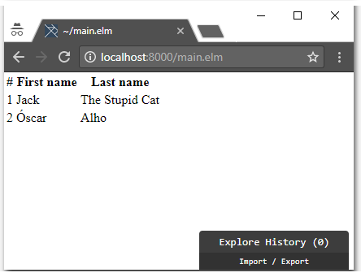
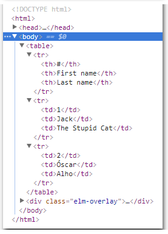

# Lunch and Learn - ELM (Day 3)

Today we want something a little more elaborate from our ELM application.

We wish to construct an application which enables a user to edit some contents in a `table`, as well as add more rows to it.

For the MVP (minimum viable product) we have the following acceptance criteria:

- [ ] A table with three columns will be presented to the user;
  - [ ] The first column is the number of the row;
  - [ ] The second column is for "First name";
  - [ ] The third column is for "Last name";
- [ ] The table starts with two rows: `1 | Jack | The Stupid Cat` and `2 | Óscar | Alho`
- [ ] The user can click the cells on the rows to edit the content
  - [ ] The user cannot edit the number of the row;

The following has been identified as features for "next version":

- Adding some style/good looks to our table;
- Obtaining the structure of the table from a remote server (HTTP);
- Submitting the content the user has changes to a remote server (HTTP);
- Using "local storage" to survive F5/refresh/browser crash while the user is editing;


## Let's start with.. the view?


We assume our `main.elm` file starts with the same content as the one from [Day 1][Day1].

If we were to create a [plain old simple table using HTML](https://www.w3schools.com/html/html_tables.asp) we would have something like:

```html
<table>
  <tr>
    <th>#</th>
    <th>First name</th>
    <th>Last name</th>
  </tr>
  <tr>
    <td>1</td>
    <td>Jack</td>
    <td>The Stupid Cat</td>
  </tr>
  <tr>
    <td>2</td>
    <td>Óscar</td>
    <td>Alho</td>
  </tr>
</table>
```

Let's construct this on our `view` function, to get acquainted with ELM's `Html` package. We need to keep in mind that in ELM **everything is a function**. This means that the `Html` package provides us with pure functions. Let's take a look at how we convey the intention to build the HTML above using ELM functions:

```elm
---- VIEW ----


view : Model -> Html Msg
view model =
    Html.table
        []
        [ Html.tr
            []
            [ Html.th [] [ Html.text "#" ]
            , Html.th [] [ Html.text "First name" ]
            , Html.th [] [ Html.text "Last name" ]
            ]
        , Html.tr
            []
            [ Html.td [] [ Html.text "1" ]
            , Html.td [] [ Html.text "Jack" ]
            , Html.td [] [ Html.text "The Stupid Cat" ]
            ]
        , Html.tr
            []
            [ Html.td [] [ Html.text "2" ]
            , Html.td [] [ Html.text "Óscar" ]
            , Html.td [] [ Html.text "Alho" ]
            ]
        ]

```

Whoa, whoa! What's this? So many things, so strange to look at. Well, let's at least give it an opportunity.

Okay, so in ELM all the functions have a signature. This means we can see (for instance) what is the signature for [`Html.table`](http://package.elm-lang.org/packages/elm-lang/html/2.0.0/Html#table). Here is is:

```elm
table : List (Attribute msg) -> List (Html msg) -> Html msg
```

So, the `table` function (inside the `Html` package) takes two inputs and returns `Html msg`. The first input is something that has type `List (Attribute msg)` and the second type is something that has type `List (Html msg)`.

We could dive deep into ELM's types here, but maybe we can try to fit this into our brains a little latter along the way. 

Let me try to come up with an easier way to read the function signature: in order to create a `<table>` HTML element, we need to provide a (possibly empty) list of `Attribute`s and also provide a (possibly empty) list of `Html` elements. 

If we look at the signature for [`Html.tr`](http://package.elm-lang.org/packages/elm-lang/html/2.0.0/Html#tr), [`Html.th`](http://package.elm-lang.org/packages/elm-lang/html/2.0.0/Html#th), [`Html.td`](http://package.elm-lang.org/packages/elm-lang/html/2.0.0/Html#td), we will see the same signature pattern:

```elm
tr : List (Attribute msg) -> List (Html msg) -> Html msg
```

```elm
th : List (Attribute msg) -> List (Html msg) -> Html msg
```

```elm
td : List (Attribute msg) -> List (Html msg) -> Html msg
```

We used one other function from the `Html` package: `Html.text`. This one has an even simpler signature:

```elm
text : String -> Html msg
```

This function represents simple text inside an element. If we wanted to create the HTML `<td>foo</td>` we would use `Html.td [] [ Html.text "foo" ]`.

Let's use `elm-reactor` to observe the result of the `view` function we implemented above. We will see both how it looks on the browser and also have a look at the generated HTML (by using F12/Inspect):





The generated HTML looks pretty neat, right? In fact, it even looks exactly like the HTML that we wanted in the first place.

**Protip:** I am using the prefix `Html.` for all the functions in my view, because it helps understand where the function comes from. A trick we can do is to change our `import Html` declaration to this:

```elm
import Html exposing (Html, table, tr, th, td, text)
```

This will then allow us to write our same `view` function like this:
```elm
---- VIEW ----


view : Model -> Html Msg
view model =
    table
        []
        [ tr
            []
            [ th [] [ text "#" ]
            , th [] [ text "First name" ]
            , th [] [ text "Last name" ]
            ]
        , tr
            []
            [ td [] [ text "1" ]
            , td [] [ text "Jack" ]
            , td [] [ text "The Stupid Cat" ]
            ]
        , tr
            []
            [ td [] [ text "2" ]
            , td [] [ text "Óscar" ]
            , td [] [ text "Alho" ]
            ]
        ]
```

This reads even better now. Let's leave it like this. The promise that you need to make is to use explicit import of those functions, so that if a fellow developer wants to know where that `table` function is coming from, he can just *Ctrl+Find* it. This is a best practice and you receive an *elmillion* million internet points for doing this :)

One thing we notice about our table is that it doesn't really "look" like a table. Maybe having some lines would help? We are not CSS designers (yet!), so let's just use the [`border`](https://www.w3schools.com/tags/att_table_border.asp) attribute:

```html
<table border="1">
```

We saw that the `Html.table` function takes a `List (Attribute msg)` as its first input. Right now we are passing an empty list (`[]`). Let's try to put our `border` attribute there. Turns out that `border` is a deprecated attribute, so ELM doesn't provide a `border` function. This is not an issue. We can work around it by using the more generic [`attribute`](http://package.elm-lang.org/packages/elm-lang/html/2.0.0/Html-Attributes#attribute) function:

```elm
attribute : String -> String -> Attribute msg
```

```elm
table
    [ Html.Attributes.attribute "border" "1" ]
    [ ... ]
```

ELM rightfully complains that it never heard about this `Html.Attributes`. Let's import it:

```elm
import Html.Attributes
```

Our table now looks a little more like a table (even if it is still awful):


## First steps into Functional Programming


Before diving into the `Model` let's start using some simple techniques from "functional programming" to improve our `view` function.

Let's look at the first "`<tr>`" returned by our `view` function:

```elm
tr 
    [] 
    [ th [] [ text "#" ] 
    , th [] [ text "First name" ] 
    , th [] [ text "Last name" ]
    ]
```

Let's make our very first use of the [`map`](http://package.elm-lang.org/packages/elm-lang/core/latest/List#map) function.
`map` has a particularly interesting signature:

```elm
map : (a -> b) -> List a -> List b
```

Trying to read this as humans, we see that `map` function has 2 inputs. The first input is `(a -> b)`. This means "a function that has 1 input of type `a`, and an output of `b`. There are no restrictions on what `a` or `b` are, and they can even be the same".

The second input of `map` is a `List a`, which basically is a list/array of elements of type `a`. The restriction here is that whatever type `a` is, it must be the same for both the first and the second inputs of `map`.

Finally, the output of `map` is a `List b`. Again, whatever type this `b` is, it must be the same as in `(a -> b)`.

Let's see the canonical example for `map`, using `elm repl`:

```elm
> List.map (\x -> x * 2) [1,2,3]
[2,4,6] : List number
```

In this example, `(\x -> x * 2)` is the first argument for `map`, and `[1,2,3]` is the second argument.

`(\x -> x * 2)` is what is called an *anonymous function*. It takes some `x` as input and will return `x * 2` as the output. ELM will infer the types for us. What would happen if we provided a list of the wrong type? ELM's compiler would let us know:

```elm
> List.map (\x -> x * 2) ["a", "b", "c"]
-- TYPE MISMATCH --------------------------------------------- repl-temp-000.elm

The 2nd argument to function `map` is causing a mismatch.

3|   List.map (\x -> x * 2) ["a", "b", "c"]
                            ^^^^^^^^^^^^^^^
Function `map` is expecting the 2nd argument to be:

    List number

But it is:

    List String

Hint: I always figure out the type of arguments from left to right. If an
argument is acceptable when I check it, I assume it is "correct" in subsequent
checks. So the problem may actually be in how previous arguments interact with
the 2nd.
```

How can `map` help us improve our `view` function? Let's try out a function `asTableHeaders`:

```elm
asTableHeaders : List String -> List (Html Msg)
asTableHeaders headers =
    List.map (\headerText -> th [] [ text headerText]) headers
```

This is a function that will take a `List String` and return a `List` of `Html Msg`. 

`List (Html Msg)` is exactly the type for the second input of the `tr` function.

That means we can now do this:

```elm
---- VIEW ----


view : Model -> Html Msg
view model =
    table
        [ Html.Attributes.attribute "border" "1" ]
        [ tr
            []
            (asTableHeaders [ "#", "First name", "Last name" ])
        , tr
            []
            [ td [] [ text "1" ]
            , td [] [ text "Jack" ]
            , td [] [ text "The Stupid Cat" ]
            ]
        , tr
            []
            [ td [] [ text "2" ]
            , td [] [ text "Óscar" ]
            , td [] [ text "Alho" ]
            ]
        ]


asTableHeaders : List String -> List (Html Msg)
asTableHeaders headers =
    List.map (\headerText -> th [] [ text headerText]) headers
```

We can use the same technique for the `td` functionss in the rows themselves, by creating an `asRowCells` function:

```elm
asRowCells : List String -> List (Html Msg)
asRowCells cells =
    List.map (\cellText -> td [] [ text cellText ]) cells
```

And now use it in our `view` function:

```elm
---- VIEW ----


view : Model -> Html Msg
view model =
    table
        [ Html.Attributes.attribute "border" "1" ]
        [ tr
            []
            (asTableHeaders [ "#", "First name", "Last name" ])
        , tr
            []
            (asRowCells [ "1", "Jack", "The Stupid Cat" ])
        , tr
            []
            (asRowCells [ "2", "Óscar", "Alho" ])
        ]


asTableHeaders : List String -> List (Html Msg)
asTableHeaders headers =
    List.map (\headerText -> th [] [ text headerText]) headers


asRowCells : List String -> List (Html Msg)
asRowCells cells =
    List.map (\cellText -> td [] [ text cellText ]) cells
```

If we refresh our browser now (we are using `elm reactor` to serve our `main.elm` file), everything should still look the same. The thing to keep in mind here is that we are in an *exploratory* phase. We are getting a feeling for the task we have at hands, and ELM compiler is constantly keeping us in check with our types and functions.

I am looking at our current `view` function and I see two things that we can help us get closer to our final objective:
* From our requirments, the first column in each row is its number. We can adapt `asRowCells` to reflect this fact;
* The number of rows is undetermined at runtime. We start with 2, but the user can add more rows. This seems to be calling for another `map` function;

Let's tackle this and see how it turns out. Again, *exploration* is the word of the day.

We are going to add an `Int` to the inputs of `asRowCells` to represent the number of the row that is being returned.

```elm
asRowCells : Int -> List String -> List (Html Msg)
asRowCells rowNumber cells =
    let
        rowNumberCell =
            td [] [ text rowNumber ]

        rowCells =
            List.map (\cellText -> td [] [ text cellText ]) cells
    in
        rowNumberCell :: rowCells
```

Wait, what?? What just happened? `let`, `in`... `::` ? Holy molly 😱. Let's take it one step at a time.

The construct `let (...) in (...)` is basically how ELM allows us to declare "*variables*" (they are assign-only variables, efectively making them constants). 

Take for instance this function:

```elm
foo : Int -> Int -> Int
foo x y =
    let
        sum = 
            x + y
        prod =
            sum * x
    in
        sum + prod
```

We can use `elm repl` to test it out. Inserting multi-line functions into `elm repl` is somewhat anoying, because we need to indent them correctly and trail all our expressions with `\` except for the final one. Here it is in a `repl` friendly format:

```elm
foo x y =          \
  let              \
    sum = x + y    \
    prod = sum * x \
  in               \
    sum + prod
```

We can now interact with `foo` directly on the `repl`:

```elm
---- elm-repl 0.18.0 -----------------------------------------------------------
 :help for help, :exit to exit, more at <https://github.com/elm-lang/elm-repl>
--------------------------------------------------------------------------------
> foo x y =          \
|   let              \
|     sum = x + y    \
|     prod = sum * x \
|   in               \
|     sum + prod
<function> : number -> number -> number
> foo 1 1
4 : number
> foo 1 2
6 : number
> foo 2 1
9 : number
>
```

So we can now see the purpose of `let (consts) in (declaration)`. 👍

What about that strange [`::`](http://package.elm-lang.org/packages/elm-lang/core/latest/List#::)? Well, that is just a function with signature `(::) : a -> List a -> List a` that appends an element of type `a` to the head of a `List a` (remember that this means that the element itself must be of the same type as the elements on the `List`). This function is also known as `cons`. Examples:

```elm
1 :: [2,3] == [1,2,3]
1 :: [] == [1]
"a" :: ["a"] == ["a","a"]
```

We can now better understand our new `asRowCells` function, so let's update our `view` function to use it:

```elm
view : Model -> Html Msg
view model =
    table
        [ Html.Attributes.attribute "border" "1" ]
        [ tr
            []
            (asTableHeaders [ "#", "First name", "Last name" ])
        , tr
            []
            (asRowCells 1 [ "Jack", "The Stupid Cat" ])
        , tr
            []
            (asRowCells 2 [ "Óscar", "Alho" ])
        ]
```

If we try to refresh our browser, ELM's compiler will do its job telling us that our work isn't correct:

```elm
Detected errors in 1 module.


-- TYPE MISMATCH ------------------------------------------------------ main.elm

The argument to function `text` is causing a mismatch.

92|                     text rowNumber 
                             ^^^^^^^^^
Function `text` is expecting the argument to be:

    String

But it is:

    Int
```

Yes ELM, you are right as usual. So how do we convert an `Int` to a `String`. If you said "there must be a function" for that, we are right. The function is [`toString`](http://package.elm-lang.org/packages/elm-lang/core/latest/Basics#toString) and its signature is quite simple: `toString : a -> String`

Let's adjust our `asRowCells` to use `toString` before passing it to the `text` function:

```elm
asRowCells : Int -> List String -> List (Html Msg)
asRowCells rowNumber cells =
    let
        rowNumberCell =
            td [] [ text (toString rowNumber) ]

        rowCells =
            List.map (\cellText -> td [] [ text cellText ]) cells
    in
        rowNumberCell :: rowCells

```

We can now F5 our browser and the table will still look the same. That's good, but we don't feel like making real progress yet.


## Time to bring the first "dynamicness" feeling


If we remember the signature of our `view` function, we notice that it receives the `Model` as its input. Let us define a `Model` that enables us to keep the existing representation of the table, without having hardcoded values inside the `view` function. Let's keep in mind that there is no such thing as a perfect model. There are only useful or non useful models.

One such model that could be useful to represent the existing table would be:

```elm
---- MODEL ----


type alias Model =
    { headers : List String
    , rows : List Row
    }


type alias Row =
    List String
```

We are now in a discovery/refactor cycle. We cannot use the browser to see any work until the ELM compiler is satified. ELM's compiler is letting us know that the `init` function is not implemented according to its type specification:

```elm
Detected errors in 1 module.


-- TYPE MISMATCH ------------------------------------------------------ main.elm

The definition of `init` does not match its type annotation.

51| init : ( Model, Cmd Msg )
52| init =
53|>    "world" ! []

The type annotation for `init` says it is a:

    ( Model, Cmd Msg )

But the definition (shown above) is a:

    ( String, Cmd msg )
```

We must now fix our `init` function to return a record with the shape that we defined our `Model` to have:

```elm
---- INIT ----


init : ( Model, Cmd Msg )
init =
    { headers = [ "#", "First name", "Last name" ]
    , rows =
        [ [ "Jack", "The Stupid Cat" ]
        , [ "Óscar", "Alho" ]
        ]
    } ! []
```

Okay, ELM's compiler is happy now. Yet, we know that our `view` function isn't using these rows that we put on our `model`. Let's change our `view` function to use these values:

```elm
---- VIEW ----


view : Model -> Html Msg
view model =
    let
        headerRow =
            model.headers
                |> asTableHeaders

        tableRows =
            model.rows
                |> List.indexedMap
                    (\rowNumber row ->
                        asTableRow (rowNumber + 1) row
                    )
    in
        table
            [ Html.Attributes.attribute "border" "1" ]
            (headerRow ++ tableRows)


asTableHeaders : List String -> List (Html Msg)
asTableHeaders headers =
    List.map (\headerText -> th [] [ text headerText ]) headers


asTableRow : Int -> Row -> Html Msg
asTableRow rowNumber cells =
    let
        rowNumberCell =
            td [] [ text (toString rowNumber) ]

        rowCells =
            cells |> asRowCells
    in
        tr [] (rowNumberCell :: rowCells)


asRowCells : List String -> List (Html Msg)
asRowCells cells =
    List.map (\cellText -> td [] [ text cellText ]) cells
```

No, no, no! What have you done?? A new function `asTableRow`? A new symbol `|>`?? Oh dear, here we go again. So about the `asTableRow` function, we have seen this before, nothing really surprising here. But let's take a second to appreciate the [`|>`](http://package.elm-lang.org/packages/elm-lang/core/latest/Basics#|>) function. It is oficially known as *Forward function application*, but its friends call it `pipe`. It has a signature that should be friendly enough by now:

```elm
(|>) : a -> (a -> b) -> b
```

Basically this function receives two inputs: something of type `a` and a function that itself takes an input of that same type `a` and returns something of type `b`. Finally, our pipe function returns something of type `b`. Why is this function even useful, you may ask?
Its purpose in life is to decrease parenthesis nesting, therefore increasing code readability by decreasing the amount of stacked operations a human needs to keep in his brain.

Shamelessly copy-pasting the example from ELM's documentation, the pipe function allows us to transform this messy code:

```elm
scale 2 (move (10,10) (filled blue (ngon 5 30)))
```

Into this much more readable code:

```elm
ngon 5 30
    |> filled blue
    |> move (10, 10)
    |> scale 2
```

Notice how the `filled` function takes 2 inputs, but with the pipe function it only seems to take one. That is because the pipe function is expanding `ngon 5 30 |> filled blue` into `filled blue (ngon 5 30)`. Our eyes, fingers and brains will grow used to this pipe function the more we use it. And because it is (just like everything else) a pure function, it has no magic.

We can now F5 our application and we see that our application still looks the same, which is a good thing, but we have now removed the hard-coded rows from our `view` function. We are in a good direction!


## Our first interaction


If we recall back to our requirements, we need to give the user the possibility to edit the contents of the table. This means we need to capture this user intention. In ELM the way we convey user intentions or even system facts is always though a message. This message will have one of the types defined by our own type `Msg`. Right now we have defined `Msg` as `NoOp`:

```elm
---- MSG ----


type Msg
    = NoOp
```

Any of the messages inside our `Msg` type can contain a payload. Each message conveys either an intention from the user, or a fact that occurred in our application. 

There are currently 4 editable cells in our table: 2 cell in two 2 rows. We need a way to distinguish those cells from one another. Maybe we can look at each cell as having a coordinate. Maybe `{ row : Int, col : Int }` would be a way to represent the coordinate of a cell.

Let's create a type to represent this coordinate:

```elm
type alias CellCoordinates = 
    { row : Int
    , col : Int
    }
```

Before we dive into the more complicated scenario of editing the content of a cell, let's add a feature to help us visualize what is going on. We will add a feature that highlights the cell that is currently being *hovered* by the user.

Hovering consists of two things: the mouse cursor entering an area, and the mouse cursor leaving this area. We already have two javascript callbacks that can notify us of these events: [`onMouseEnter`](https://www.w3schools.com/jsref/event_onmouseenter.asp) and [`onMouseLeave`](https://www.w3schools.com/jsref/event_onmouseleave.asp). First things first, let's create two new messages to convey the result of these events:

```elm
---- MSG ----


type Msg
    = OnMouseEnterCell CellCoordinates
    | OnMouseLeaveCell
```

Here, we have defined that an `OnMouseEnterCell` can happen in our application, and it will have a payload of type `CellCoordinates` (that we defined above). Also, an `OnMouseLeaveCell` can happen, and here we are being a little smart and we do not really care about what particular cell was left, because there can only be one hovered cell at any given time.

We will now edit our `view` function to emit these messages. In order to represent on the result of the `view` function that we want to be "wired" to javascript events, we need to import these functions from the [`Html.Events`](http://package.elm-lang.org/packages/elm-lang/html/2.0.0/Html-Events) ELM package. Let's add this import, that already brings the `onMouseEnter` and `onMouseLeave` ELM functions into our file:

```elm
import Html.Events exposing (onMouseEnter, onMouseLeave)
```

Let's take a quick look at the signature of these two functions:

```elm
onMouseEnter : msg -> Attribute msg

onMouseLeave : msg -> Attribute msg
```

This `msg` is not related to our `Msg`. Remember that any lowercase words in a function's signature represents the constraint that the same word must be of the same type in all usages within the same signature. [`Attribute`](http://package.elm-lang.org/packages/elm-lang/html/2.0.0/Html#Attribute) is an opaque union type that represents an intention to attach a particular attribute to an HTML element.

We are now able to invoke these two functions inside our `view` function. We need to listen to the `onMouseEnter` and `onMouseLeave` from our `<td>` elements. These `<td>` elements are currently being generated by our `asRowCells` function.

If we are going to add this "behaviour" to the `<td>` returned by `asRowCells`, maybe it is a good idea to rename it, just so that it doesn't bring unexpected surprises to someone using it in the future. `asHoverableRowCells`. Meh, naming is hard. Another thing that we notice right away is that in order for us to send the message `OnMouseEnterCell` we need to know what are the `CellCoordinates`. In order to know the `CellCoordinates` we need the row and cell numbers. Let's add the row number as a parameter to `asHoverableRowCells`. Our new `asHoverableRowCells` now looks like this:

```elm
asHoverableRowCells : Int -> List String -> List (Html Msg)
asHoverableRowCells rowNumber cells =
    let
        cellCoordinate = 
            asCellCoordinates rowNumber
        
        mouseEnterCellMessage =
            OnMouseEnterCell << cellCoordinate
    in
        List.indexedMap (\cellNumber cellText -> 
            td [ onMouseEnter (mouseEnterCellMessage (cellNumber + 1)) ] [ text cellText ]) cells
```

Oh no, no no! Why do you do this to me? What is that `asCellCoordinates`? Oh and that weird `<<` ?? C'mon..

Okay, one step at a time, just like before. `asCellCoordinates` is (just like everything in ELM) a function that I sneaked in, hoping you wouldn't notice. Look at it:

```elm
asCellCoordinates : Int -> Int -> CellCoordinates
asCellCoordinates row col =
    { row = row
    , col = col
    }
```

Oh, okay. A function that takes two `Int` and returns a `CellCoordinates`. Okay, no big deal. But wait, when you are calling that function, you only call it with one `Int`: `cellCoordinate =  asCellCoordinates rowNumber`. What gives? Is this a bug?

Nope. This is actually something quite normal in functional programming. You see, when you specify that any function's signature is `fun : A -> B -> C -> D`, you are actually declaring a chain of functions. Basically functions are first class citizens in functional languages, and ELM is no different. If you call `fun 1`, the return isn't `D`. The return is itself a function. An implicit function that now has signature ``fun` : B -> C -> D``. This technique is called partial function application, and it takes a little while to sink in. Once again, if you would call this function with one single argument, you would get back a new implicit function with signature ```fun`` : C -> D```.

This is exactly what we have in our local const `cellCoordinate`. It is a function waiting for another `Int` so that it can return a `CellCoordinate`.

Let that sink in, because the function we introduce next is even more mind bending: [`<<`](http://package.elm-lang.org/packages/elm-lang/core/latest/Basics#<<). Oh boy. So, what's happening here? Well, first of all, the message we want to issue is itself a function (yes, everything is a function): `OnMouseEnterCell`. Remeber that `OnMouseEnterCell` requires a payload? This payload is of type `CellCoordinate`. So basically, if we look at the signature for `<<` we have:

```elm
(<<) : (b -> c) -> (a -> b) -> a -> c
```

`<<` is a function with **three** arguments:
1. A function that takes an input `b` and has an output of `c`;
2. A function that takes an input `a` and has an output of `b`;
3. A value of type `a`

`<<` will then have an output of type `c`. Let's see how this applies to our sittuation:

```elm
    let
        cellCoordinate = 
            asCellCoordinates rowNumber
        
        mouseEnterCellMessage =
            OnMouseEnterCell << cellCoordinate
```

We have seen that `OnMouseEnterCell` is a function with signature `CellCoordinates -> Msg`.

We have seen that `cellCoordinate` is a function with signature `Int -> CellCoordinates`.

When we do `mouseEnterCellMessage = OnMouseEnterCell << cellCoordinate` we are complying with its signature:

```
(<<) (b -> c)                 -> (a -> b)                 -> a   -> c
(<<) (CellCoordinates -> Msg) -> (Int -> CellCoordinates) -> Int -> Msg
```

We are, once again, taking advantage of partial function application here: we have provided 2 inputs out of 3 to the `<<` function. This means that `mouseEnterCellMessage` is now a function with signature `Int -> Msg`. Let that sip in, it is a mind twist in the beginning. I still struggle with it whenever I want to use function composition, and that is why I am quite grateful to ELM's compiler for constantly having my back and guiding me in the right direction. Notice that `mouseEnterCellMessage` is a partial function, and when we finally want to use it, we provide it with its final argument, so that it can give us the `Msg` that `onMouseEnter` requires:

```elm
    in
        List.indexedMap (\cellNumber cellText -> 
            td [ onMouseEnter (mouseEnterCellMessage (cellNumber + 1)) ] [ text cellText ]) cells
```

**Work in progress ...**

- [x] Explore `map` function still inside the `view`
- [x] Now add something to `Model`
- [x] Implement `init`
- [ ] Click a cell + the first message

[Day1]: ../Day1/main.elm